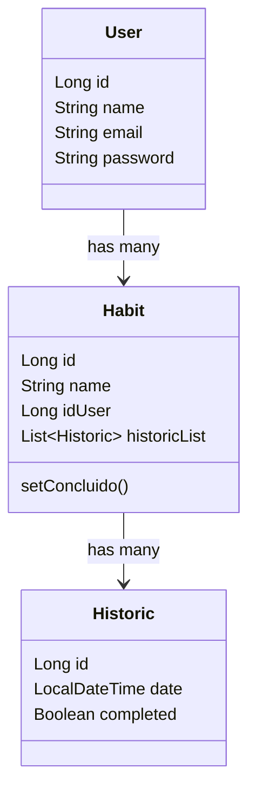

# Habit Tracker API 🧠✅

API RESTful desenvolvida em Java com Spring Boot para controle de hábitos diários. Permite o cadastro de usuários, criação de hábitos e marcação de hábitos como concluídos, além de manter um histórico.

---

## 🛠 Tecnologias utilizadas

- Java 17
- Spring Boot
- Spring Data JPA
- Hibernate
- H2 Database (banco em memória)
- Gradle
- Swagger (Springdoc OpenAPI)

---

📌 Funcionalidades
 Cadastro de usuários

 Criação de hábitos

 Marcação de hábito como concluído

 Histórico de hábitos concluídos

 Remoção de hábitos

 Integração com Swagger
 

🧠 Diagrama de Classes

